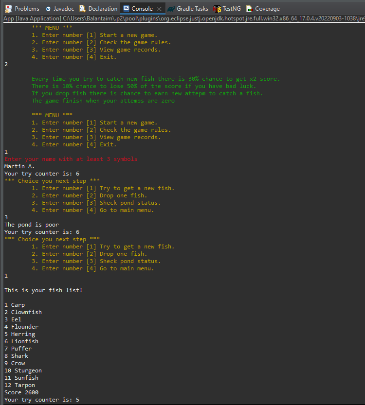
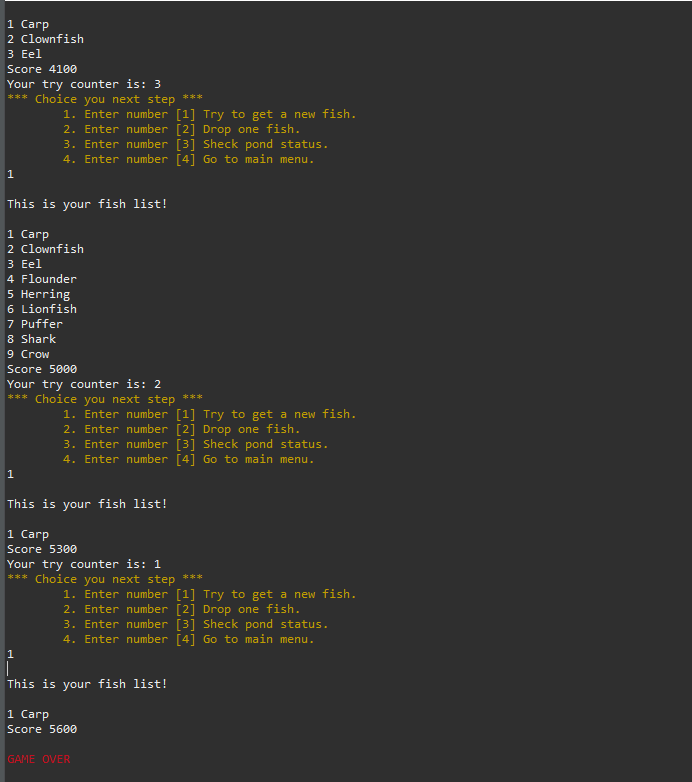

# FishingGame Java MVC 

Software architecture: MVC

This is console game writen in Java

Features: XML parser for string resources, save/load records in/from .txt file, color messages, game navigation, game score calculation

